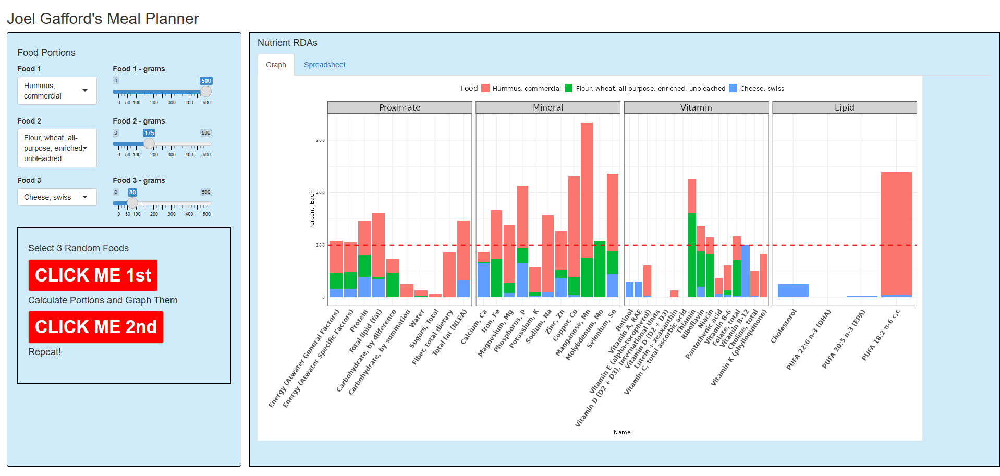
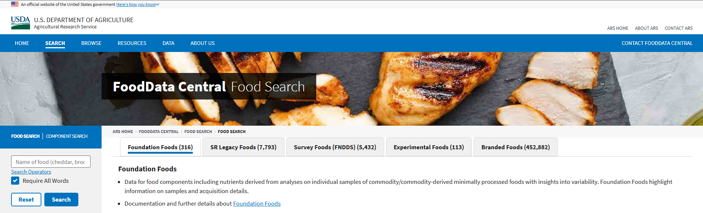
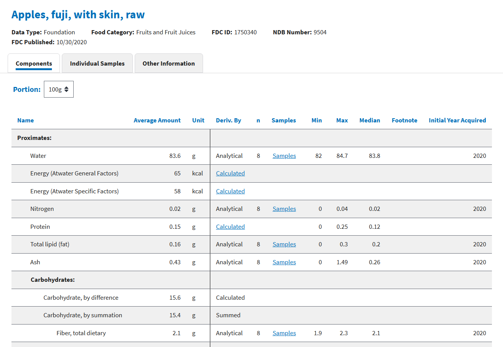
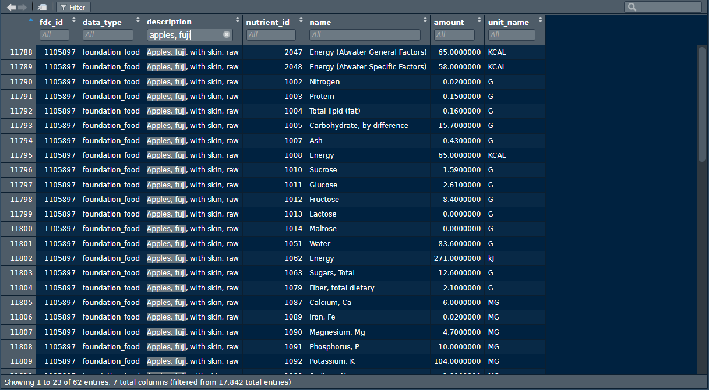
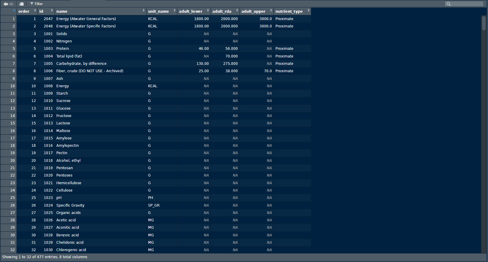
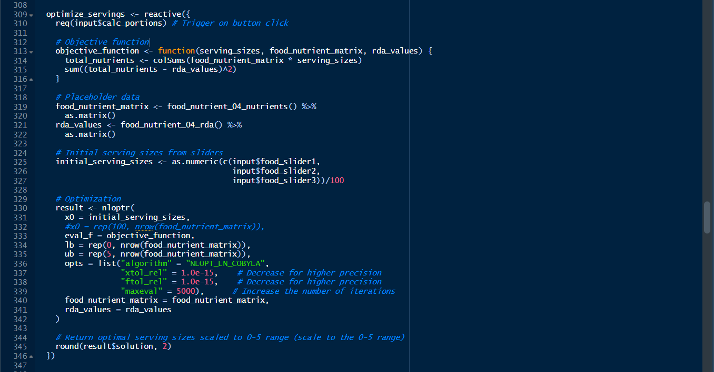
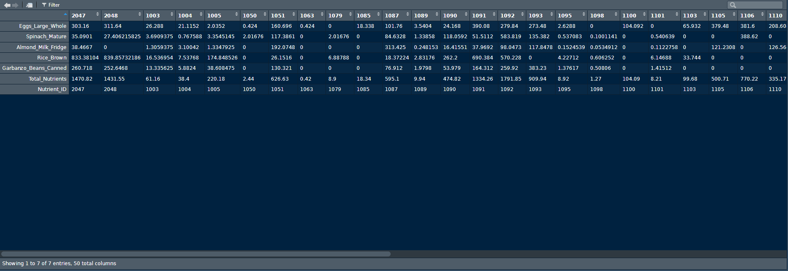
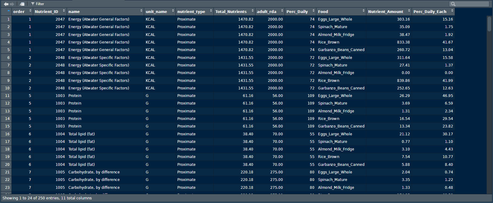
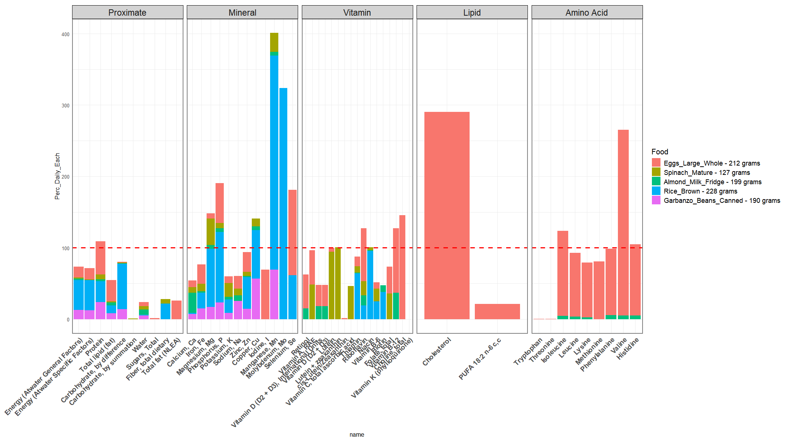

JG_Data_Science_Meal_Planner

This project is a portfolio piece for my data science resume. I used RStudio and Shiny to create a meal planning app that takes a few random foods, analyzes their nutrient amounts, and then adjusts portion sizes for each food, targeting 100% RDA values for each nutrient.

## Project Summary

Link to the RStudio Shiny web app:
https://joelthomasgafford.shinyapps.io/JG_Data_Science_Meal_Planner/

The USDA website records nutrient information on nearly half a million foods, most of which are branded foods. This app will use the 316 "Foundation Foods" to make things simpler and more performant.

Each foundation food records different nutrients and their amounts in calories, grams, milligrams, etc. The default portion size is 100 grams.

The USDA website allows you to download the .csv files yourself, which I did. After a bit of data transformation in R, I had each foundation food with its corresponding nutrient_ids and amounts.

Here is the nutrient table, but with a new column I created called, "adult_rda". This records what the Recommended Dietary Allowance is for each nutrient. Notice that not all nutrients have RDA values. Also, there are 477 different nutrients, but most foods only have a few dozen nutrients recorded for them. I take this into account when creating the Shiny app.

Using RStudio's "nloptr" package, I automated the process of figuring out what the portion sizes should be for each food, targeting not only 100% RDA values for just calories, but for each and every nutrient.

Next, the portion sizes are multiplied by each respective food and their nutrients and added up.

The data is converted from wide format into long format so that ggplot2 can use it.

Here is the data visualized using ggplot2. 

Everything you just saw had to be redesigned to work with Shiny's reactive functions, which was challenging. But it works now!

TLDR: Play with the app!
https://joelthomasgafford.shinyapps.io/JG_Data_Science_Meal_Planner/
